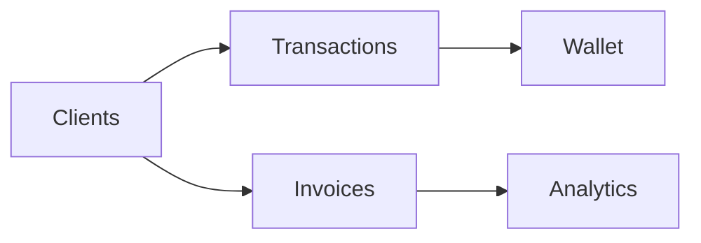

# Penny Pilot – Client Management Module

> **A modern, integrated CRM for your financial workflow.**

---

## ✨ Overview
Penny Pilot's Client Management module brings powerful CRM features to your financial dashboard. Manage clients, track transactions, generate invoices, and visualize analytics—all in one place.

---

## 🚀 Core Features

- **Add/Edit/Delete Clients** (individual & business)
- **Client Types & Status** (prospect, active, inactive)
- **Contact & Financial Info** (email, phone, credit limit, payment terms)
- **Transactions** (income/expense, wallet integration)
- **Invoices** (draft, sent, paid, overdue)
- **Search & Filter** (by name, status, type)
- **Analytics Dashboard** (client stats, revenue, status charts)
- **PDF Export** (one-click client & analytics reports)
- **Responsive, Modern UI** (desktop & mobile)

---

## 📊 At a Glance



**Analytics Example:**


---

## ⚡ Quick Start

1. **Install & Setup**
   - Ensure Node.js, npm, and MySQL are installed.
   - Configure your `.env`:
     ```env
     MYSQLHOST=localhost
     MYSQLUSER=root
     MYSQLPASSWORD=yourpassword
     MYSQLDATABASE=penny_pilot
     PORT=3000
     ALPHA_VANTAGE_API_KEY=your_alpha_vantage_key
     ```
2. **Start the Server**
   ```sh
   npm install
   npm start
   ```
3. **Access the App**
   - Main Dashboard: [http://localhost:3000](http://localhost:3000)
   - Client Management: [http://localhost:3000/clients](http://localhost:3000/clients)

---

## 📝 Usage

- **Add a Client:** Click "Add Client", fill in details, and save.
- **Record a Transaction:** Use the transaction button on a client card.
- **Create an Invoice:** Use the invoice button on a client card.
- **View Analytics:** See real-time stats and charts on the dashboard.
- **Export PDF:** One-click export of client data and analytics.

---

## 🛡️ Security & Compatibility
- User authentication required for all features
- Data isolation: each user sees only their own data
- Fully responsive: works on desktop, tablet, and mobile

---

## 📂 Tech Stack
- **Frontend:** HTML5, CSS3, JavaScript (ES6+), Chart.js, jsPDF
- **Backend:** Node.js, Express, MySQL2

---

## 📸 Screenshots
> _Add your own screenshots or diagrams here for a more visual README!_

---

**Made with ❤️ by the Penny Pilot Team**
