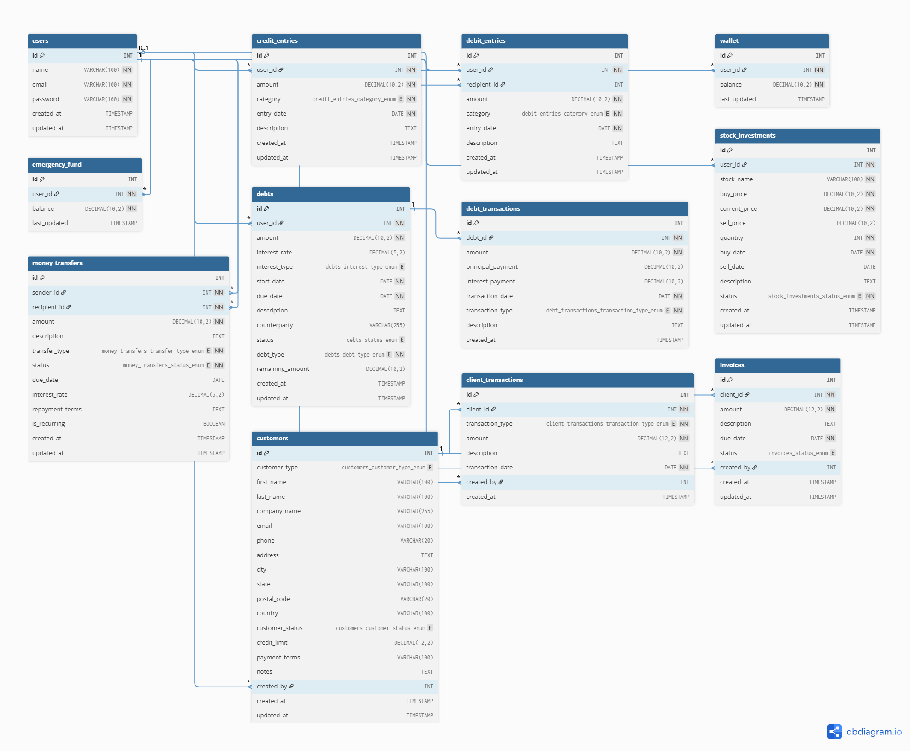

# Penny Pilot – Modern Personal & Business Finance Suite

> **A unified platform for investments, client management, money transfer, debts, analytics, and more.**

---

## ✨ Project Overview
Penny Pilot is a full-featured financial management web app. Track your investments, manage clients, transfer money, handle debts, and visualize your financial health—all in one place, with a modern, responsive UI.

---

## 🧩 Main Modules

- **Dashboard**: Real-time financial overview, charts, and quick stats
- **Investments**: Buy/sell shares, fetch live prices, track portfolio performance
- **Wallet**: Manage your cash balance, see all inflows/outflows
- **Money Transfer**: Send/receive money, track transfers, manage requests
- **Debts**: Record, track, and settle debts with friends or clients
- **Client Management**: CRM for business users—clients, transactions, invoices, analytics

---

## 🚀 Core Features

- **Live Stock Prices** (Alpha Vantage API integration)
- **Buy/Sell Stocks** with real-time portfolio updates
- **Wallet Integration** across all modules
- **Money Transfer** with request/approval flow
- **Debt Tracking** with due dates and interest
- **Client CRM**: Add/edit/delete clients, transactions, invoices
- **Analytics Dashboard**: Revenue, status, and investment charts
- **PDF Export**: Reports for investments, clients, and analytics
- **Search & Filter** everywhere
- **Responsive, Modern UI** (desktop & mobile)
- **Authentication & Security**

---

## 🏗️ System Architecture


---

## 🗄️ Database ER Diagram

The following diagram illustrates the database structure for Penny Pilot:



---

## ⚡ Quick Start

### 1. Prerequisites
- Node.js (v14+ recommended)
- npm (v6+)
- MySQL Server

### 2. Clone the Repository
```sh
git clone https://github.com/yourusername/penny-pilot.git
cd penny-pilot
```

### 3. Install Dependencies
```sh
npm install
```

### 4. Configure Environment Variables
Create a `.env` file in the root directory:
```env
MYSQLHOST=localhost
MYSQLUSER=root
MYSQLPASSWORD=yourpassword
MYSQLDATABASE=penny_pilot
PORT=3000
ALPHA_VANTAGE_API_KEY=your_alpha_vantage_key
```

### 5. Import the Database
Run the SQL script to set up the database:
```sh
mysql -u root -p penny_pilot < penny_pilot_unified.sql
```

### 6. Start the Server
```sh
npm start
```

### 7. Access the App
- Main Dashboard: [http://localhost:3000](http://localhost:3000)
- Investments: [http://localhost:3000/Investment/Investments.html](http://localhost:3000/Investment/Investments.html)
- Money Transfer: [http://localhost:3000/MoneyTransfer/moneytransfer.html](http://localhost:3000/MoneyTransfer/moneytransfer.html)
- Debts: [http://localhost:3000/Debts/debts.html](http://localhost:3000/Debts/debts.html)
- Clients: [http://localhost:3000/clients](http://localhost:3000/clients)

---

## 📝 Usage Guide

### Dashboard
- View real-time financial stats, charts, and quick links to all modules.
- Visualize your portfolio, cash flow, and recent activity.

### Investments
- Buy/sell shares with live price updates (Alpha Vantage API).
- Track your portfolio performance and history.
- Export investment reports as PDF.

### Wallet
- View your cash balance and all inflows/outflows.
- Integrated with all modules for seamless transactions.

### Money Transfer
- Send/receive money to/from other users.
- Request money, approve/decline requests.
- Track all transfers in one place.

### Debts
- Record debts with friends, clients, or businesses.
- Track repayments, due dates, and interest.
- Mark debts as settled and export debt reports.

### Client Management
- Add/edit/delete clients for business use.
- Record transactions, create invoices, and view analytics.
- Export client and invoice data as PDF.

### Analytics
- Visualize revenue, investment performance, and client stats.
- Interactive charts and downloadable reports.

---

## 🛡️ Security & Privacy
- **Authentication**: Secure login required for all features.
- **Data Isolation**: Each user sees only their own data.
- **Input Validation**: All forms and APIs are validated.
- **API Keys**: Sensitive keys are stored in `.env` (never commit to repo).
- **HTTPS Recommended**: For production deployments.

---

## 📂 Tech Stack

### Frontend
- HTML5, CSS3, JavaScript (ES6+)
- Chart.js (for analytics and charts)
- jsPDF (for PDF export)
- Responsive design (mobile-first)

### Backend
- Node.js
- Express.js
- MySQL2 (database connector)
- Alpha Vantage API (stock prices)

### Utilities
- PDF Export (custom scripts)
- Toast notifications
- Modular codebase for easy extension

---

## 🧑‍💻 Project Structure

```
Penny-Pilot/
├── Dashboard/           # Backend dashboard utilities
├── Debts/               # Backend debts utilities
├── frontend/
│   ├── Dashboard/       # Frontend dashboard UI
│   ├── Debts/           # Frontend debts UI
│   ├── Investment/      # Frontend investments UI
│   ├── Investments/     # (Legacy/alternate investments UI)
│   ├── Clients/         # Frontend client management UI
│   ├── Loginpage/       # Login and authentication UI
│   ├── MoneyTransfer/   # Money transfer UI
│   └── utils/           # Shared frontend utilities
├── node_modules/
├── package.json
├── server.js            # Main backend server
├── penny_pilot_unified.sql # Database schema
└── ...
```

---


## 🙏 Acknowledgements
- [Alpha Vantage](https://www.alphavantage.co/) for stock price API
- [Chart.js](https://www.chartjs.org/) for charts
- [jsPDF](https://github.com/parallax/jsPDF) for PDF export
- All open-source contributors

---

**Made with ❤️ by the Penny Pilot Team**

---

<!--
README generated with AI assistance. Replace screenshot placeholders with your own images for best results.
-->
